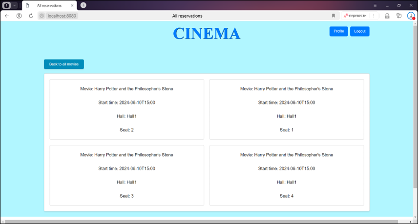

# Видеотека

## Обзор

**Веб-сервис**, реализующий упрощенный функционал кинотеатра. Предоставляет возможность бронировать места на интересующие показы фильмов.

## Стек

`Java 17`, `Maven`, `Servlets`, `JDBC`, `PostgreSQL`,  `Lombok`,  `Junit5`, `Assertj`, `Mockito`

## Реализованый функционал

### Aдминистратор

- Вход в систему
- Просмотр всех имеющихся залов кинотеатра
- Просмотр списка всех имеющихся фильмов с возможностью фильтрации по основным полям
- Добавление нового фильма
- Редактирование имеющегося фильма
- Удаление фильма
- Просмотр списка всех имеющихся показов с возможностью фильтрации по основным полям
- Добавление нового показа
- Редактирование имеющегося показа
- Удаление показа
- Просмотр списка всех бронировщиков у выбранного показа
- Возможность скачивать pdf-ticket выбранного бронировщика
- Возможность удалять бронирование
- Выход из системы

### Пользователь

- Вход в систему
- Просмотр списка всех показываемых фильмов с возможностью фильтрации по основным полям
- Выбор доступного показа
- Выбор свободного места в кинозале
- Возможность скачать pdf-ticket
- Просмотр истории бронирований
- Выход из системы

## База данных

В качестве базы данных в приложении используется Postgres. ER-диаграмма изображена на рисунке:

## Страницы, доступные всем

### Login page

### Registration page

## Страницы, доступные администратору

### Admin panel page

### All movies page

### Movie page

### Edit movie page

### Add new movie page

### All screenings page

### All screenings page

### Screening page

### Add new screening page

### Edit screening page

### Bookmakers page

### Bookmaker page

### All halls page

## Страницы, доступные клиенту

### All displayed movies page

### Displayed movie page

### Choose seat page

### Reservation page

### Reservation page

### All reservation page

## Связь

- **Email**: schebetovskiyvadim@gmail.com
- **Telegram**: [Vadim Schebetovskiy](https://t.me/VadimSchebet)
- **Вк:** [Щебетовский Вадим](https://vk.com/vadimschebetovskiy)
